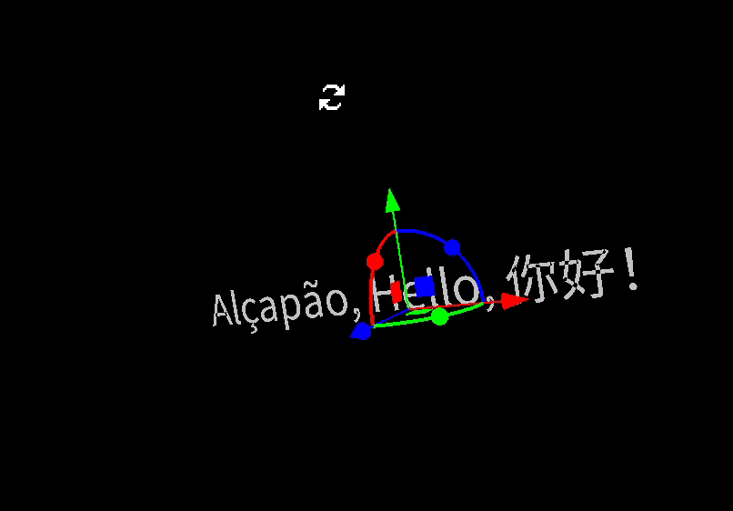
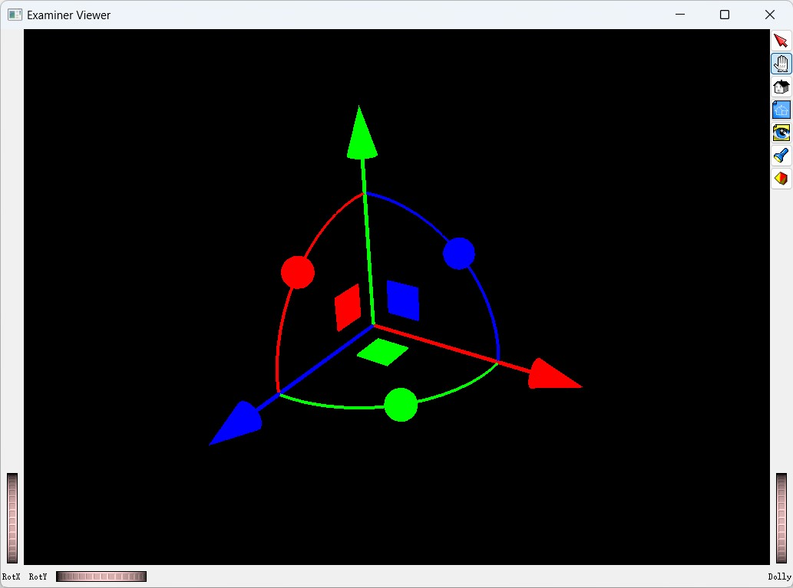
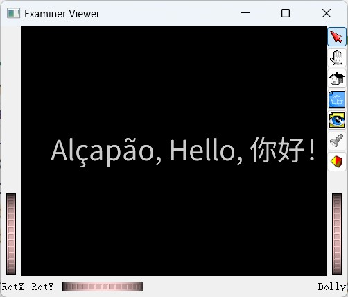

# SoFCDragger

This is a standalone version of coin3d dragger implemented in FreeCAD, therefore you can use it without the FreeCAD library.





# How to build
install vcpkg.

create a `CMakeUserPresets.json` file as follows:

```json
{
    "version": 6,
    "configurePresets": [
        {
            "name": "default",
            "inherits": "vcpkg",
            "environment": {
                "VCPKG_ROOT": "<Path to vcpkg root>"
            }
        }
    ]
}
```

then 

```
mkdir build
cd build
cmake .. --preset default
cmake --build .
```

run the executable with `./bin/dragger`.




# Notes

## How to display a utf8 text

Generally you can use `SoText2` to display a utf8 text, but the default font only contains latin charset, therefore an extra font is required. Set the font with `SoFont` node, put the font ttf file in the runtime path or set the `COIN_FONT_PATH` environment variable (`coin_setenv` may be helpful). See [here](https://www.coin3d.org/coin/classSoFont.html#details) for more details. 

```c++
auto font = new SoFont;
font->name = "NotoSansSC-Regular.ttf";

auto text = new SoText2;
text->string = "Alçapão, Hello, 你好！";

auto sep = new SoSeparator;
sep->addChild(font);
sep->addChild(text);
```

